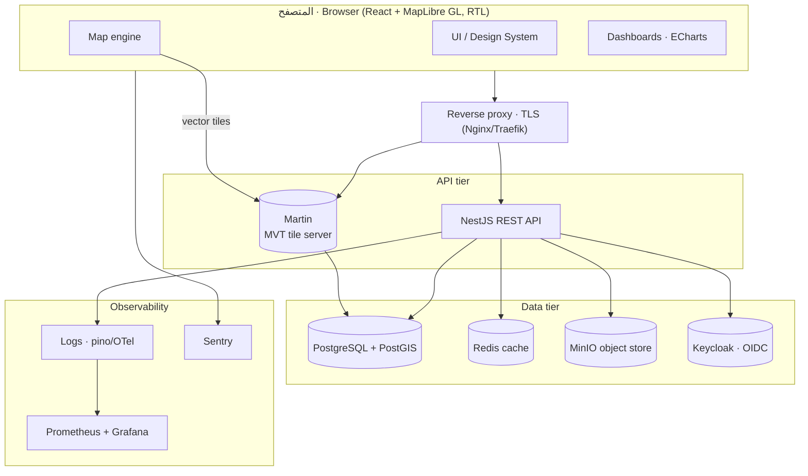

# 03 · System Architecture — معمارية النظام

## 3.1 Overview
A modular, self-hostable web platform: a React/MapLibre frontend, a NestJS API, a
PostGIS database as the spatial source of truth, a Martin tile server turning PostGIS
geometry into vector tiles, plus object storage, cache and identity services. All
components are containerised and orchestrated with Docker Compose (V1) → Kubernetes (V2+).

## 3.2 Component diagram

## 3.3 Request flows
- **Map paint:** browser requests MVT tiles `…/plots/{z}/{x}/{y}.pbf` from Martin →
  Martin runs `ST_AsMVT` over PostGIS → GPU-rendered by MapLibre. Attributes for the
  clicked feature come from the tile; full record/documents come from the NestJS API.
- **Plot edit / rename / reshape:** browser → NestJS (RBAC check) → transaction on
  PostGIS (`plots` update + `plot_versions` insert + `audit_log` insert) → tile cache
  invalidated → map refetches affected tiles.
- **Dashboard:** browser → NestJS aggregate endpoints (cached in Redis) → ECharts.
- **Documents/media:** browser → NestJS (presigned URL) → MinIO direct up/download.

## 3.4 Technology stack (authoritative)

| Layer | Technology | Notes |
|---|---|---|
| Frontend | React 18 + TypeScript + Vite | SPA, code-split by module |
| Map | MapLibre GL JS 4 + react-map-gl; terra-draw (edit); deck.gl (V2 viz) | open, no key, 3D extrusion |
| Basemaps | Protomaps (PMTiles) light + Esri/satellite raster | self-hostable light style |
| State | Zustand (map/UI) + TanStack Query (server) | |
| UI | Tailwind CSS + Radix UI, RTL, KEC tokens | light theme only |
| Charts | Apache ECharts | best RTL/Arabic |
| API | NestJS (Node + TypeScript) | modular, DI, guards |
| ORM/DB access | Prisma + raw SQL/PostGIS for geometry | |
| Database | PostgreSQL 16 + PostGIS 3 | spatial source of truth |
| Tiles | Martin (pg → MVT) | live tiles from PostGIS |
| Auth | Keycloak (OIDC/RBAC); Auth.js+JWT acceptable for V1 | |
| Object storage | MinIO (S3 API) | docs, media, imports, exports |
| Cache/queue | Redis + BullMQ | tiles, sessions, jobs |
| Search | Postgres FTS + pg_trgm (V1) → OpenSearch (V2+) | |
| Reporting | Puppeteer (server PDF) + MapLibre canvas export | |
| Deploy | Docker Compose → Kubernetes | |
| CI/CD | GitHub Actions | lint, test, build, image, deploy |
| Observability | pino + OpenTelemetry, Prometheus/Grafana, Sentry | |

## 3.5 Deployment topology
- **V1 (single host):** Docker Compose — `web`, `api`, `postgis`, `martin`, `redis`,
  `minio`, `keycloak`, `proxy`. Suitable for internal pilot.
- **V2+ (cluster):** Kubernetes; stateless `api`/`web`/`martin` scaled horizontally;
  managed/replicated Postgres; object storage and identity as shared services; CDN in
  front of static assets and basemap tiles.

## 3.6 Environments
`local` (compose) → `staging` → `production`. Config via environment variables and a
typed config module; no secrets in code (see `18` security & `20` deployment in roadmap).

## 3.7 Cross-cutting concerns
- **AuthN/AuthZ:** OIDC tokens; NestJS guards enforce role + permission per route.
- **Auditing:** an interceptor writes an `audit_log` row for every mutating request.
- **Validation:** DTOs (class-validator) + PostGIS constraints (`ST_IsValid`).
- **Caching:** Redis for aggregates and tile ETags; HTTP cache headers on tiles.
- **Versioning:** every geometry/attribute change snapshots into `plot_versions`.
